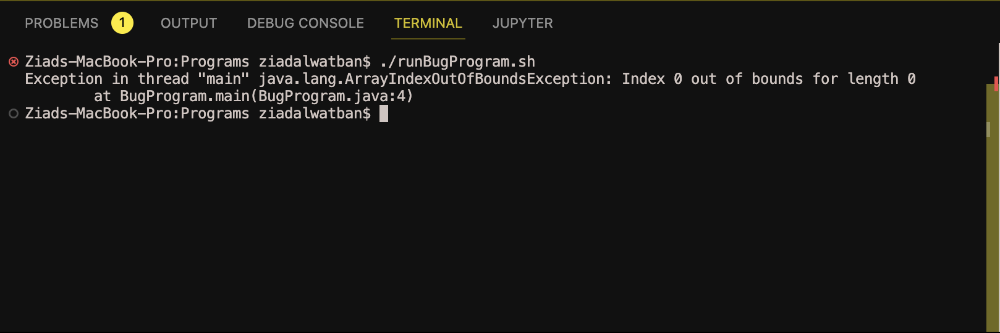

# Part 1 – Debugging Scenario

## Student

Hello!

I'm running a Java script from a Bash shell script. Everything seems okay with it but I'm getting an error that I can't figure out.

I think the problem might be in my Bash script, but I'm not sure. The exception occurs when the bash script is supposed to pass a filename to the BugProgram.

Here's a screenshot of the error:

Thanks,
Ziad

## TA

Hi,

Can you please print out the value of the filename variable that you're passing from the Bash script to your BugProgram just before the Java command?

Please add an echo statement before calling Java command in your bash script like this:

`echo $filename
java BugProgram $filename`

Then please share the terminal output.

## Student

Hello,

I added the echo statement as you suggested and ran the script again. Here's what I got:

I ran into the same error.

Setup Information

The file & directory structure needed:

    /project
        runBugProgram.sh
        BugProgram.java

The contents of each file before fixing the bug:

runBugProgram.sh

`#!/bin/bash
filename=$1
java BugProgram $filename`

BugProgram.java

`public class BugProgram {
  public static void main(String[] args) {
    String fileName = args[0];
    System.out.println("Reading file: " + fileName);
    // Code to read file and process data
  }
}`

The full command line  you ran to trigger the bug:

`bash runBugProgram.sh`

A description of what to edit to fix the bug:

It looks like you are not providing the filename as an argument. You should run your Bash script with the filename as a parameter, like this:

`bash runBugProgram.sh test.txt`

Ensure you replace test.txt with your actual file name.

Part 2 – Reflection

One of the coolest things I learned the second half of this quarter is actually something unrelated to debugging, I really enjoyed meeting my lab mates and group's TA. Learning about their different cultures and backgrounds really stuck with me.
