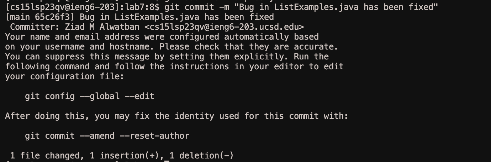

# Lab Report 4

## Step 4

First of all, I used `ssh cs15lsp23qv@ieng6.ucsd.edu` to log into my ieng6 account.

## Step 5

Then I cloned the git repository using `git clone https://github.com/ucsd-cse15l-s23/lab7`

## Step 6

Using the command `cd lab7/` I navigated to the lab 7 folder and ran the tests using `bash test.sh` which indeed failed.

## Step 7

To access the Java file with the bugs I typed out the command `vim ListExamples.java`, I then navigated to the error, `index1`, and typed out the command `dw` to delete the word. After that, I pressed `i` for insert mode. Which allowed me to replace the deleted word with the right one, `index2`, then I exited using `esc`. Finally, I entered the command `:wq` to save and exit.

## Step 8

Now to test the file, I enter the command `bash test.sh` which indeed does show us the tests running succesfully.

## Step 9

At last, I enter the command `git add ListExamples.java` and then `git commit -m "Bug in ListExamples.java has been fixed"` to commit my changes. After that, I used the command `git push git@github.com:watbani/lab7.git` to push all the changes to my repository.

