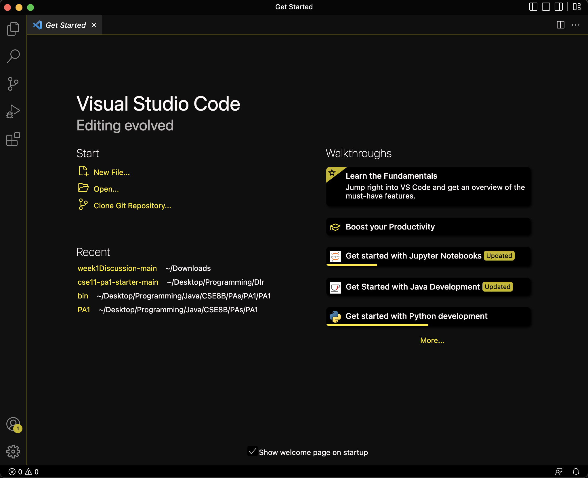
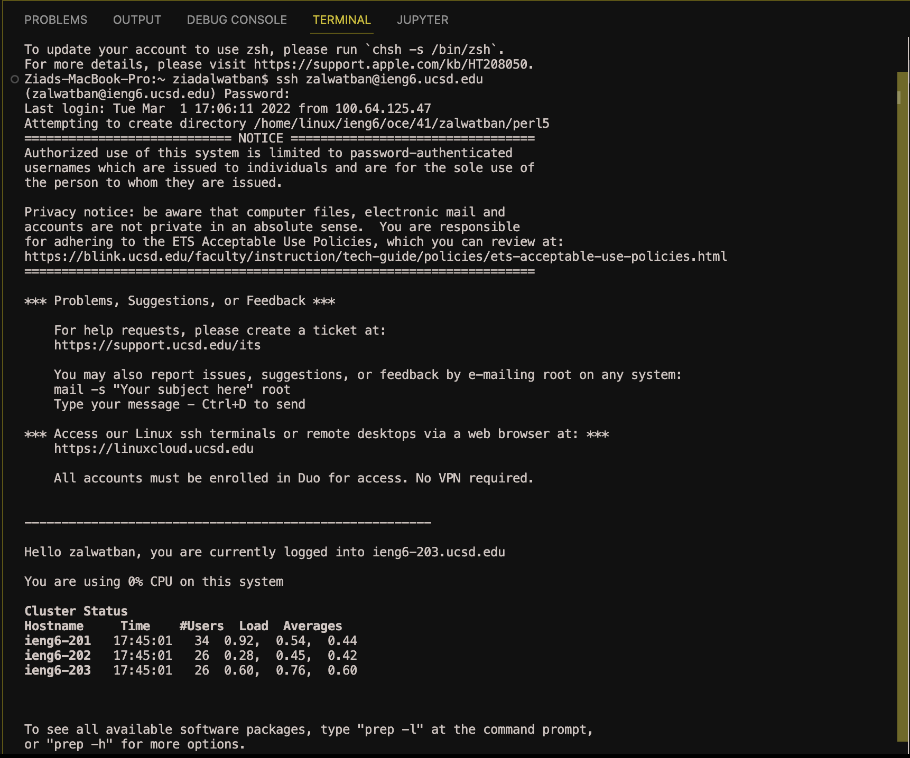
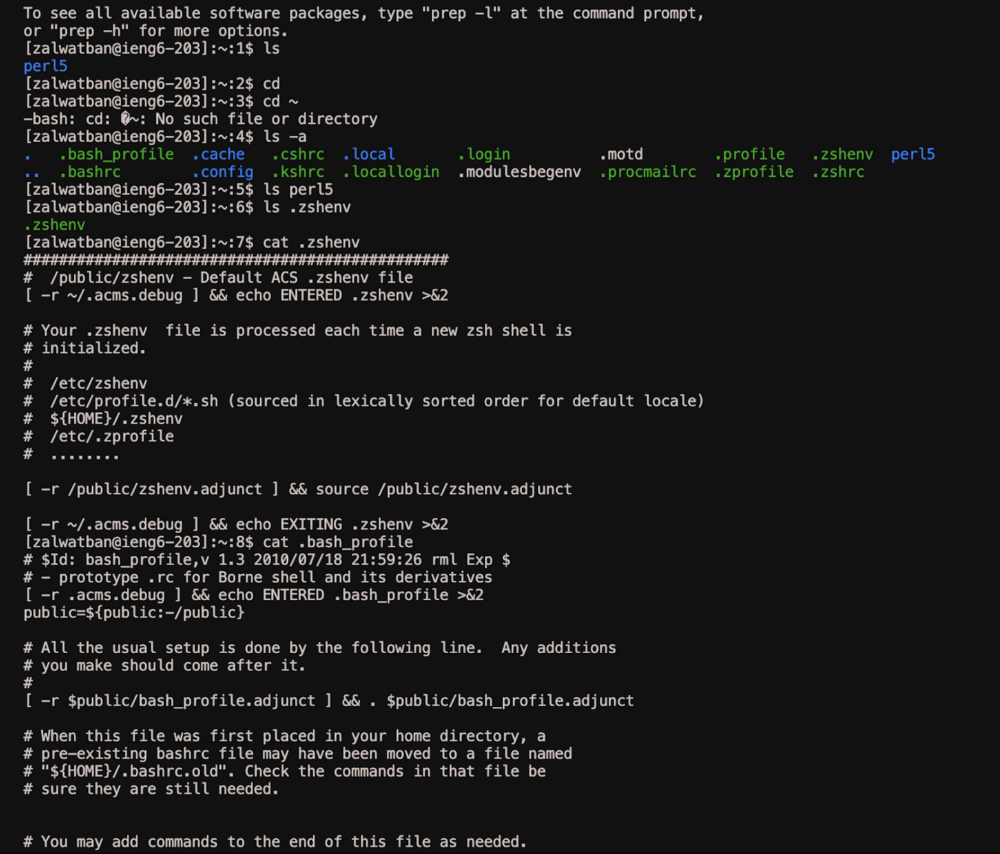

Hello there!

Today I will be teaching you how to install VScode, connect to your account, and run some commands. 

First of all, open the official [VScode website](https://code.visualstudio.com/) and download the VScode app.

After downloading the app, open it and you should be greeted by a page that looks like this.

Second, we will learn how to connect to the UCSD remote servers. If you are on Windows, then you will have to download it from [here.](https://gitforwindows.org/.)

After downloading Git, you are able to use git bash on VScode. Open a new terminal on VScode by going to terminal, then new terminal. Then use the following command to use ssh.

`ssh cs15lsp23zz@ieng6.ucsd.edu`, but change the "zz" to your own unique account name, which you can look up [here.](https://sdacs.ucsd.edu/~icc/index.php)

You will get a message after typing that command that reads,

`ssh cs15lsp23zz@ieng6.ucsd.edu
The authenticity of host 'ieng6.ucsd.edu (128.54.70.227)' can't be established.
RSA key fingerprint is SHA256:ksruYwhnYH+sySHnHAtLUHngrPEyZTDl/1x99wUQcec.
Are you sure you want to continue connecting (yes/no/[fingerprint])?`

Press yes and hit enter. After that, you will have to type in your account password.

After this whole process, text similar to this should appear on your screen:

You have successfully connected to the remote server! Congratulations!

Now let us mess around and try some commands.

You have a wide variety of commands to use, but let us focus on these chosen few for now: `cd` a command that helps you change directories, `ls` which lists the files of the current directory, `cat /home/linux/ieng6/cs15lsp23/public/hello.txt`, which concatenates or prints the file of the given path.

After trying these commands you should see an output similar to what is shown underneath. I tried inputting some of the commands that I presented above and these are the outputs I got with their respective commands.

And just like that, you have managed to successfully connect to the remote servers at the CS basement and navigated through some of its directories!

