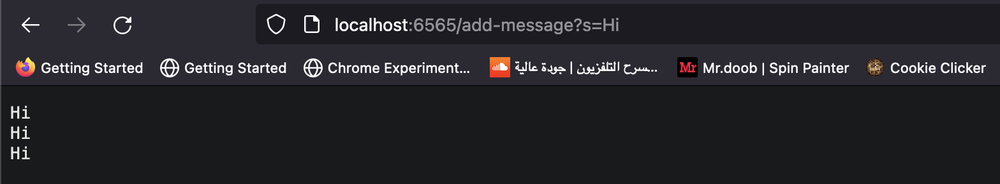
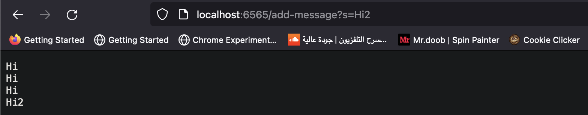
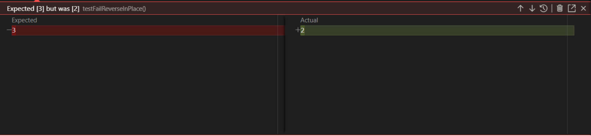
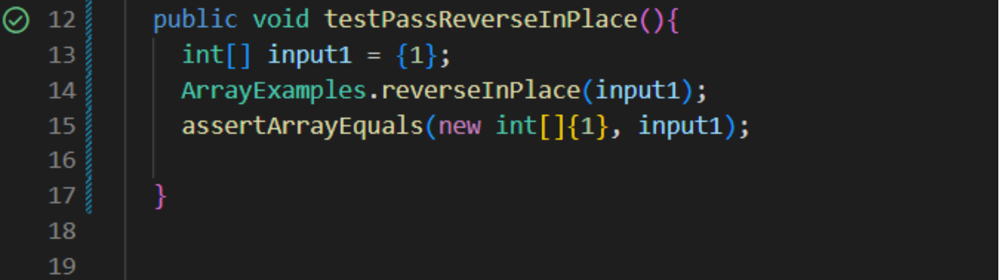

# Hello!

# Part 1
Today I will be showing you my implementation of StringServer and how I did it. 

Provided below is my code:


```
class Handler implements URLHandler {
    
    int num = 0;
    String m = "";
    public String handleRequest(URI url) {
        
        if (url.getPath().equals("/add-message")) {
            String[] param = url.getQuery().split("=");

            if(param[0].equals("s")){
                m+= param[1] + "\n";
                return m;
            }
        }
        
            else{return "404 Not Found!";}
        return "error";
        }
 ```
        
Here are two screenshots of the result after trying it on the website:





For both instances of /add-message in the screenshots, different methods were called.

## getPath(): 

Doesn't take any arguments but it returns the path of url

## split(): 

It takes a string as an argument and searches it within our url to split it into two a list of two strings, containing s and the user input.

## equals():

It takes a string as an argument and matches it to the query that's in our URL, if it does match it, then it goes on to add an inputted word to our list.


# Two values change in this instance:

## The URL:

it changes based on whatever the user inputs in the website link, such as hi and hi2 in our example.

## m:

The string m changes everytime the user inputs a new word as it is considered a placeholder for the words that the user chooses to enter in the website link.


# Part 2

Provided below is the reverseInPlace bugged code.

```
 static void reverseInPlace(int[] arr) {
    for(int i = 0; i < arr.length; i += 1) {
      arr[i] = arr[arr.length - i - 1];
    }
  }
  ```
  
The test that will fail:
```
public void testFailReverseInPlace() {
int[] input1 = {4, 3, 2, 1}; ArrayExamples.reverseInPlace(input1); assertArrayEquals(new int[]{1,2,3,4}, input1);
}
```
The test that will pass:
```
public void testPassReverseInPlace(){
int[] input1 = {1}; ArrayExamples.reverseInPlace(input1); assertArrayEquals(new int[]{1}, input1);
} }
```  

## Failed test:



## Successful test:



As shown above, the reason the second test passes and the first does not, is because only the first half is reversed in the array, and not the second.

Provided below is a fix for the bug.

## Before:
```
 static void reverseInPlace(int[] arr) {
    for(int i = 0; i < arr.length; i += 1) {
      arr[i] = arr[arr.length - i - 1];
    }
  }
  ```

## After:
```
//Changes the input array to be in reversed order
  static void reverseInPlace(int[] arr) {
    for(int i = 0; i < arr.length / 2; i += 1) {
      int varTemp = arr[i];
      arr[i] = arr[arr.length - i - 1];
      arr[arr.length - i- 1] = varTemp;
    }
  }
```

This works now because we created a variable that contains the reversed indices with all iterations which allows it to store the last index in the first, and the same for the rest.

# Part 3

The most thing I enjoyed about labs 2 and 3 is the more practical and hands on approach that we are given, through seeing the effect that my code had on real life websites it made me feel like the work I am doing is actually making an impact and I'm not writing code for the sake of finishing an assignment only.


